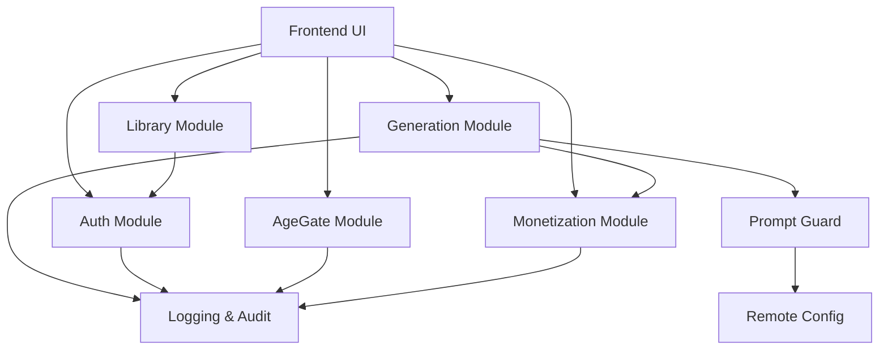

# Module Interaction Map

**Version:** 1.0 (Draft)
**Focus:** Interface Definitions & Dependency Flow

---

## 1. Core Dependency Graph

---

## 2. Module Interfaces

### A. AgeGate Module
*   **Path:** `src/modules/age-gate`
*   **Exports:**
    *   `AgeGateProvider` (Context)
    *   `useAgeGate()` (Hook)
    *   `forceAgeCheck()` (Function)

### B. Auth Module
*   **Path:** `src/modules/auth`
*   **Exports:**
    *   `AuthProvider` (Context)
    *   `useUser()` (Hook)
    *   `loginAsGuest()`
    *   `upgradeToAccount(email, pass)`

### C. Prompt Guard (Security)
*   **Path:** `src/modules/guard`
*   **Exports:**
    *   `validatePrompt(promptString, params): Promise<ValidationResult>`
    *   `ValidationResult { isValid: boolean, blockedTerms: string[] }`
    *   *Note: Must be called before `Generation`.*

### D. Generation Module (Core)
*   **Path:** `src/modules/generation`
*   **Exports:**
    *   `useGenerator()` (Hook)
    *   `createJob(prompt, params, validationToken): Promise<JobId>`
    *   `pollJob(jobId): Promise<JobStatus>`

### E. Monetization Module
*   **Path:** `src/modules/monetization`
*   **Exports:**
    *   `useCredits()` (Hook)
    *   `deductCost(actionType): Promise<boolean>`
    *   `purchasePack(packId)`

### F. Library Module
*   **Path:** `src/modules/library`
*   **Exports:**
    *   `useGallery()` (Hook)
    *   `saveToGallery(imageUrl, metadata)`
    *   `deleteFromGallery(id)`

### G. Logging & Config (Infra)
*   **Path:** `src/modules/infra`
*   **Exports:**
    *   `Logger.log(event)`
    *   `RemoteConfig.getString(key)`

---

## 3. Critical Data Flow (Happy Path)

1.  **User Input:** User enters prompt "Red shoes" in UI.
2.  **Guard Check:** UI calls `Guard.validatePrompt("Red shoes")`.
3.  **Validation:** Guard checks regex/blacklist. Returns `Token("valid_sig")`.
4.  **Cost Check:** UI calls `Pay.hasBalance(5)`. Returns `true`.
5.  **Execution:** UI calls `Gen.createJob("Red shoes", token)`.
6.  **Deduction:** `Gen` calls `Pay.deduct(5)` internally.
7.  **Result:** `Gen` returns URL.
8.  **Storage:** UI calls `Lib.saveToGallery(URL)`.

---

## 4. Forbidden Flows (Policy Violations)

*   ❌ `Lib` -> `Gen`: Library cannot re-trigger generation (avoids infinite loops/cost).
*   ❌ `Log` -> `Gen`: Logging cannot read prompt text from Generation (Privacy).
*   ❌ `Pay` -> `User`: Monetization cannot see User Profile details (Age/Name), only UserID.
